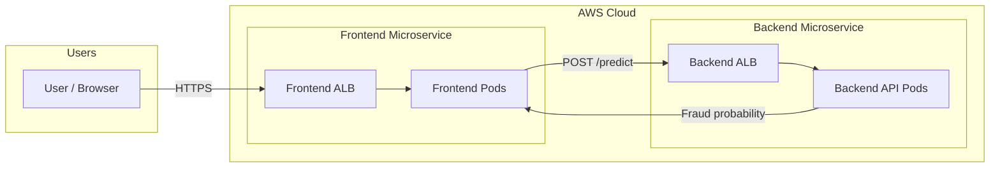
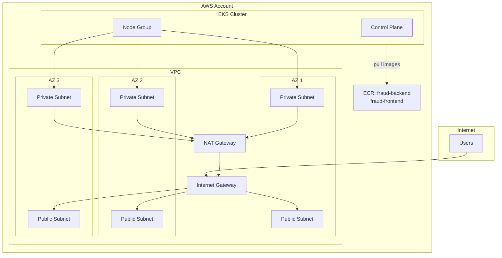
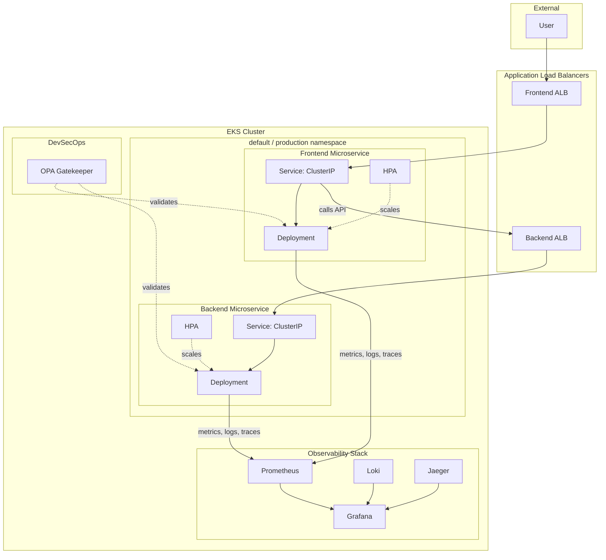
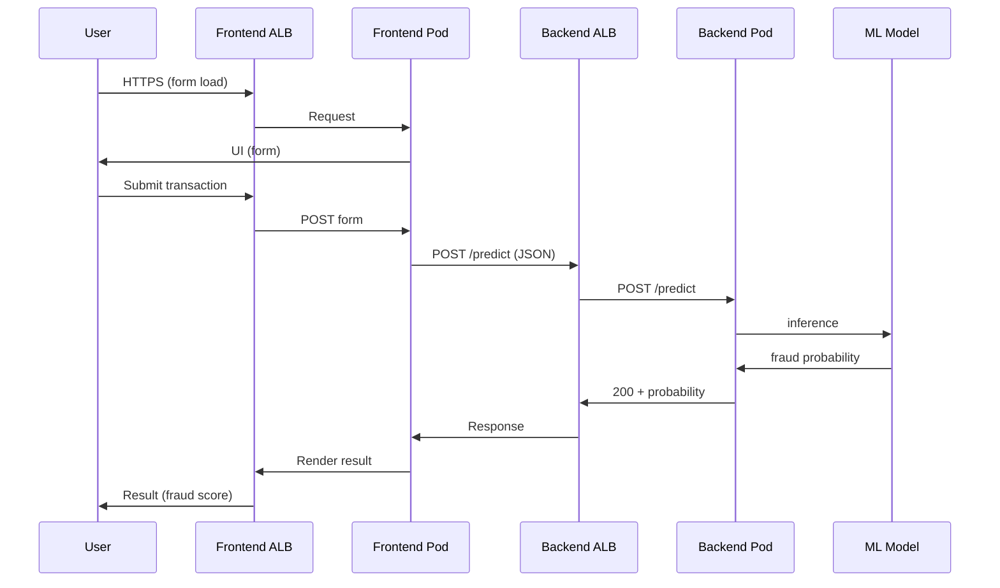
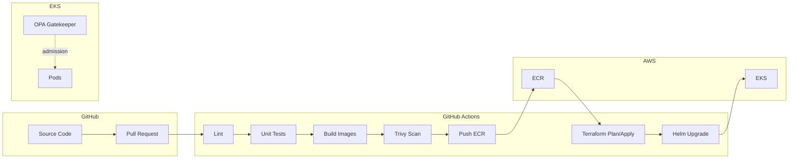
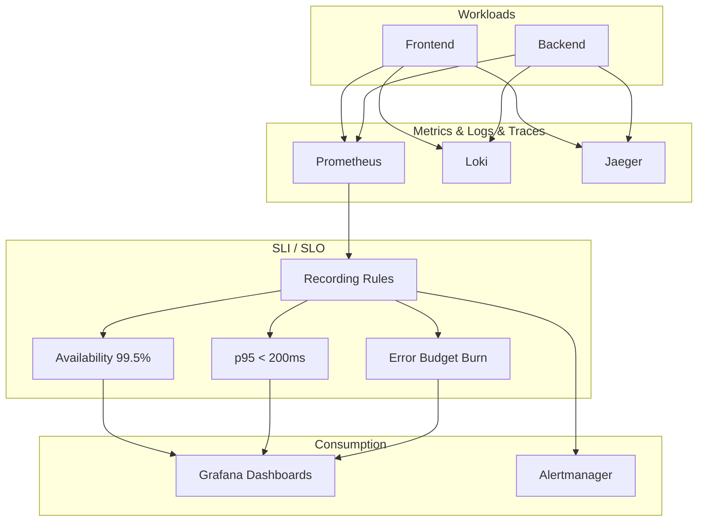
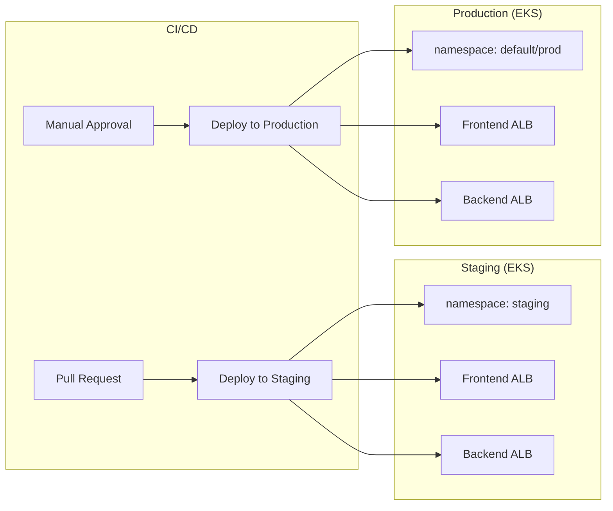

# Kubernetes-First AI Fraud Detection Platform — Architecture

This document describes the target architecture and provides diagrams you can use during execution. Render the Mermaid diagrams in GitHub, VS Code (with a Mermaid extension), or at [mermaid.live](https://mermaid.live).

**Visual overview:** See `assets/architecture-diagram.png` for a single-page diagram of the system.

---

## 1. High-Level System Context

Users hit the **frontend** via its own load balancer; the frontend calls the **backend** inference API via the backend’s own load balancer. No shared ALB — true microservice boundaries.

---

## 2. AWS Infrastructure (Terraform)

VPC with public and private subnets across 3 AZs, EKS in private subnets, NAT for egress, and ECR for images.

---

## 3. EKS Deployment — Services and Load Balancers

Each app has its own Deployment, Service, HPA, and external entry (ALB). OPA Gatekeeper and observability run in the same cluster.

---

## 4. Request Flow — Fraud Check

End-to-end path from browser to ML inference and back.

---

## 5. CI/CD and Security Pipeline

GitHub Actions: lint → test → build → scan → push ECR → Terraform → Helm. OPA enforces policy at deploy time.

---

## 6. Observability and SLOs

Golden Signals and SLOs are derived from Prometheus metrics; Grafana and Alertmanager consume them.

---

## 7. Staging vs Production (Environments)

Staging mirrors production (separate namespace, own ALBs, same code path). Promotion is PR → staging, approval → production.

---

## 8. Component Summary

| Layer            | Components |
|------------------|------------|
| **Applications** | FastAPI backend (ML inference), React/Next.js frontend |
| **Containers**   | Backend + Frontend images in ECR |
| **Orchestration**| EKS, separate Deployments/Services/HPAs per app |
| **Entry**        | One ALB per service (frontend ALB, backend ALB) |
| **Infrastructure** | Terraform: VPC, 3 AZs, public/private subnets, NAT, IGW, EKS, IRSA |
| **CI/CD**        | GitHub Actions: lint, test, build, Trivy, ECR, Terraform, Helm |
| **Security**     | OPA Gatekeeper, Pod Security Standards, Trivy |
| **Observability**| Prometheus, Grafana, Loki, Jaeger; Golden Signals + SLO dashboards |
| **Environments** | Staging + Production with separate namespaces and ALBs |

Use this document alongside **EXECUTION-GUIDE.md** and tick off phases step by step.

image.png

